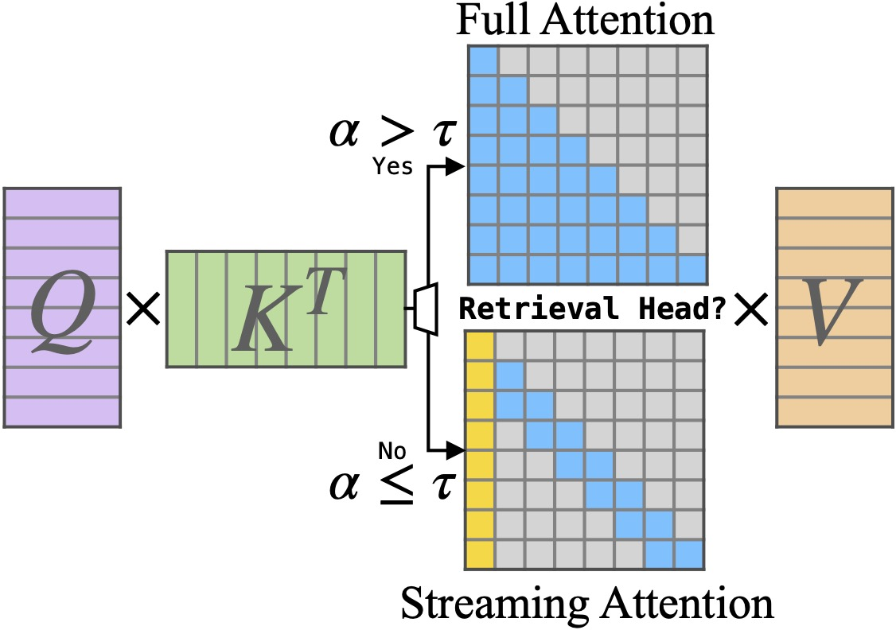

I am an undergrad at [Tsinghua University](https://www.tsinghua.edu.cn/en/), set to graduate in 2025. My research focuses on efficient machine learning systems.

Email: naohzjw [at] gmail [dot] com

Research
=====

My main research question is:

**How to increase the efficiency of machine learning systems?**

This question could be solved via a diversity of methods, ranging from pruning tokens, quantizing the parameters, to building more efficient serving systems.

<b> How I develop such a research focus? </b>

        Nowadays, modern deep neural networks, represented by large language models (LLMs), have an enormous number of parameters and consume significant amounts of energy. Scaling up the model to achieve superior capabilities is important, whereas keeping the cost down is also important. The energy OpenAI’s ChatGPT uses each year to respond to the users’ requests could power 43,204 U.S. homes for the entire year. <a href="https://www.bestbrokers.com/forex-brokers/ais-power-demand-calculating-chatgpts-electricity-consumption-for-handling-over-78-billion-user-queries-every-year/#:~:text=That%20means%20the%20energy%20ChatGPT%20uses%20each%20year%20to%20handle%20requests%20could%20power%2043%2C204%20U.S.%20homes%20for%20an%20entire%20year" style="text-decoration: none; color: blue;">[1]</a> It is an outrageous number, which consolidates my belief that we should make every endeavor to cut down the cost of AI models, thereby making the new technology accessible to everybody and making the earth a greener one.
        

[1]: . 

Other explorations
-----
When first entering the research field of artificial intelligence in 2023, I participated in the AgentVerse project (which is about multi-agents) , in collaboration with Weize Chen, Yusheng Su and other excellent guys at THUNLP.

Publications
======

    

        
    

    

        

            AgentVerse: Facilitating Multi-Agent Collaboration and Exploring Emergent Behaviors
        

        

            Weize Chen*, Yusheng Su*, <b>Jingwei Zuo</b>, Cheng Yang, Chenfei Yuan, Chi-Min Chan, Heyang Yu, Yaxi Lu, Yi-Hsin Hung, Chen Qian, Yujia Qin, Xin Cong, Ruobing Xie, Zhiyuan Liu, Maosong Sun, Jie Zhou
        

        

            ICLR 2024
        

        

            <a href="https://arxiv.org/abs/2308.10848" style="text-decoration: none; color: blue;">[paper]</a>
            <a href="https://github.com/OpenBMB/AgentVerse" style="text-decoration: none; color: blue;">[code]</a>
        

    

    

        
    

    

        

            DuoAttention: Efficient Long-Context LLM Inference with Retrieval and Streaming Heads
        

        

            Guangxuan Xiao, Jiaming Tang, <b>Jingwei Zuo</b>, Junxian Guo, Shang Yang, Haotian Tang, Yao Fu, Song Han
        

        

            arXiv
        

        

            <a href="https://arxiv.org/abs/2410.10819" style="text-decoration: none; color: blue;">[paper]</a>
            <a href="https://github.com/mit-han-lab/duo-attention" style="text-decoration: none; color: blue;">[code]</a>
            <a href="https://youtu.be/tyTkZOqKt6U" style="text-decoration: none; color: blue;">[demo]</a>
        

    

Academic Experiences
======

<b style="font-size: 1.1em;">Carnegie Mellon University</b> 
<text style="font-size: 1em;">2024.07-Present</text> 
<b style="font-size: 1em;">Remote visiting research assistant</b> 
<text style="font-size: 1em; color: #333;">InfiniAI Lab, advised by Prof. Beidi Chen</text>

<b style="font-size: 1.1em;">Tsinghua University</b> 
<text style="font-size: 1em;">2021.09-Present</text> 
<b style="font-size: 1em;">B.Eng. in Electrical Engineering</b> 
<b style="font-size: 1em;">B.S. in Fundamental Sciences (Math & Physics)</b> 
<text style="font-size: 1em; color: #333;">Research intern at THUNLP, advised by Prof. Zhiyuan Liu</text>

<b style="font-size: 1.1em;">Northeastern University</b> 
<text style="font-size: 1em;">2023.9-12</text> 
<b style="font-size: 1em;">Exchange student</b> at College of Engineering
Selected on <b style="fondt-size: 1em;"> Dean's list</b>

To Learn More About Me
======

Ideals
------
I would love to witness a world where humans could obtain more convenience, harmony, and happiness. Undeniably, my current research interest is only one minute factor contributing to this grand (and probably quixote) ideal. But the thing is, I would not like my research to go against this prospect at any time and under any circumstance.

I advocate for the open source community.

Other Experiences
------

I went to [Northeastern University](https://www.northeastern.edu/) for a one-semester exchange program in 2023 Fall and had a gorgeous time there. I love traveling around and have been to Hong Kong, Macao, Japan, Singapore, Australia, the US and of course many places of interest in mainland China.

Fun Facts About Me
------

When I get nervous, I like to scratch my hair😬. So next time you see me doing that in a debate, you know you've got me there.

Hobbies
------

I love playing tennis🎾 because smashing the ball just feels great. I also like listening to all kinds of music🎶, ranging from Mandopop (e.g. Jay Chou) to classical music (e.g. Tchaikovski). Sometimes I sing👨‍🎤. I like to travel and explore new places:).

Contacts
------

Feel free to reach out to me by email! If you are in Beijing now, probably we may even have an in-person coffee-chat! I am always glad to talk to someone else, because other's talk often inspires me and my words may inspire others too:)